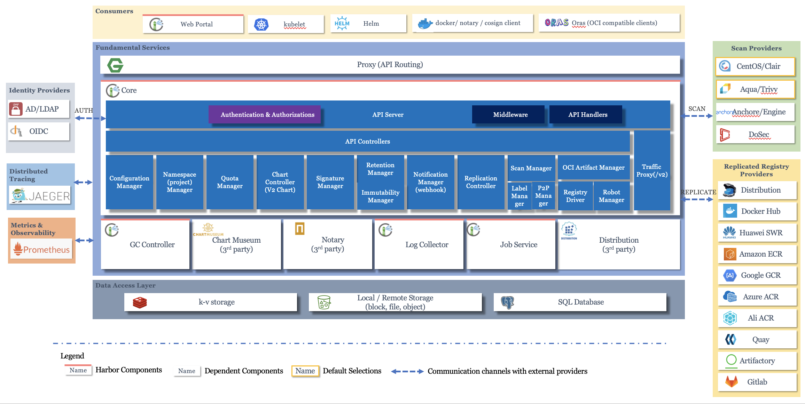

  <h1 align="center">Harbor Container Image Repository Management Tool</h1>
  

    <a href="README.md"><strong>English</strong></a> | <strong>简体中文</strong>
  

## Table of Contents

- [Repository Introduction](#repository-introduction)
- [Prerequisites](#prerequisites)
- [Image Specifications](#image-specifications)
- [Getting Help](#getting-help)
- [How to Contribute](#how-to-contribute)

## Repository Introduction
‌[Harbor‌](https://github.com/goharbor/harbor) Harbor is an open-source enterprise-grade container image registry management tool developed by VMware (now part of Broadcom) and donated to the CNCF (Cloud Native Computing Foundation). It offers advanced features such as image storage, security scanning, access control, and multi-tenancy management, making it suitable for containerized environments like Kubernetes and Docker.

**Core Features:**
1. Enterprise-Level Image Repository: Harbor provides secure and reliable Docker image storage and distribution services, supporting multi-tenant management, image replication, and garbage collection. For instance, images can be automatically synchronized to remote repositories via policies to ensure business continuity.
2. Role-Based Access Control (RBAC): Supports fine-grained user permission management, offering project-level permission controls (such as admin, developer, and guest roles), and integrates authentication methods like LDAP/AD and OIDC to meet enterprise security compliance requirements.
3. Vulnerability Scanning and Security Compliance: Built-in vulnerability scanners like Trivy and Clair automatically detect CVE vulnerabilities in images, generate detailed reports, and block the deployment of high-risk images. It supports setting scanning policies (such as scheduled scans or on-push triggers).
4. Image Signing and Content Trust: Integrates the Notary component, supports Docker Content Trust (DCT), ensuring the image source is trustworthy and unaltered. Users can verify signatures before pulling images to prevent supply chain attacks.
5. Cross-Repository Replication Policies: Supports synchronous replication (one-way/bidirectional) of images across multiple instances, providing event-based or scheduled trigger policies suitable for distributed scenarios like hybrid cloud and edge computing, such as synchronizing production images to edge nodes.
6. High Performance and Scalability: Adopts a distributed architecture design, supports backend storage integration with cloud storage like S3 and Azure Blob, easily expanding capacity. Accelerates image pulling through Redis caching, adapting to high-concurrency scenarios.
7. Webhook and Audit Logs: Provides a comprehensive event notification mechanism (such as image push/delete operations), which can trigger Webhooks to interface with CI/CD pipelines. All operations are recorded in audit logs for easy security tracing and compliance review.
8. Helm Chart Repository: In addition to Docker images, supports the storage and management of Helm Charts, uniformly managing Kubernetes application orchestration files, providing version control and dependency visualization.
9. Native Kubernetes Integration: Seamlessly collaborates with K8s, automating image pull secret management (Pull Secret) through Controllers, simplifying cluster access configuration to private repositories.
10. User-Friendly Interface and API: Offers an intuitive web console for managing images, projects, and members, while exposing RESTful APIs for deep integration with DevOps toolchains (such as Jenkins, GitLab).
11. Multi-Tenant Isolation: Achieves resource isolation through projects, allowing each tenant to independently manage images and members, suitable for large teams or SaaS service scenarios.
12. Storage Quota Management: Allows setting project-level storage quotas, limiting total image capacity to prevent resource abuse, and automatically cleaning up unreferenced layers through garbage collection mechanisms to optimize storage space.

This project offers pre-configured [**`Harbor-Container Image Repository Management Tool`**]()，images with Harbor and its runtime environment pre-installed, along with deployment templates. Follow the guide to enjoy an "out-of-the-box" experience.

**Architecture Design:**

> **System Requirements:**
> - CPU: 4vCPUs or higher
> - RAM: 16GB or more
> - Disk: At least 50GB

## Prerequisites
[Register a Huawei account and activate Huawei Cloud](https://support.huaweicloud.com/usermanual-account/account_id_001.html)

## Image Specifications

| Image Version          | Description | Notes |
|------------------------| --- | --- |
| [Harbor2.13.0-kunpeng-v1.0](https://github.com/HuaweiCloudDeveloper/harbor-image/tree/Harbor2.13.0-kunpeng-v1.0?tab=readme-ov-file) | Deployed on Kunpeng servers with Huawei Cloud EulerOS 2.0 64bit |  |

## Getting Help
- Submit an [issue](https://github.com/HuaweiCloudDeveloper/harbor-image/issues)
- Contact Huawei Cloud Marketplace product support

## How to Contribute
- Fork this repository and submit a merge request.
- Update README.md synchronously based on your open-source mirror information.