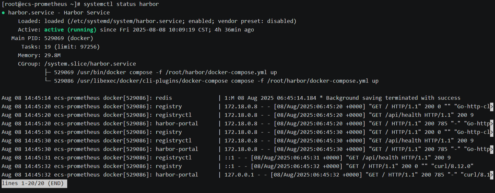
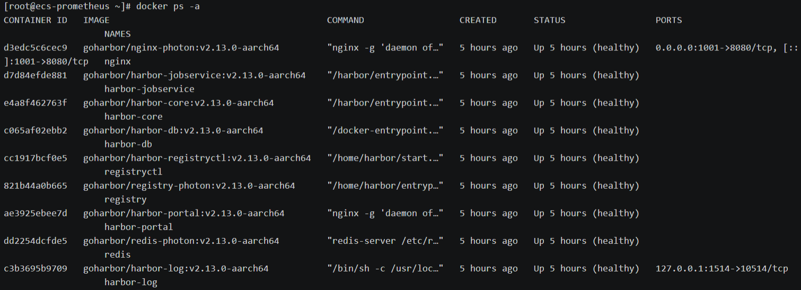
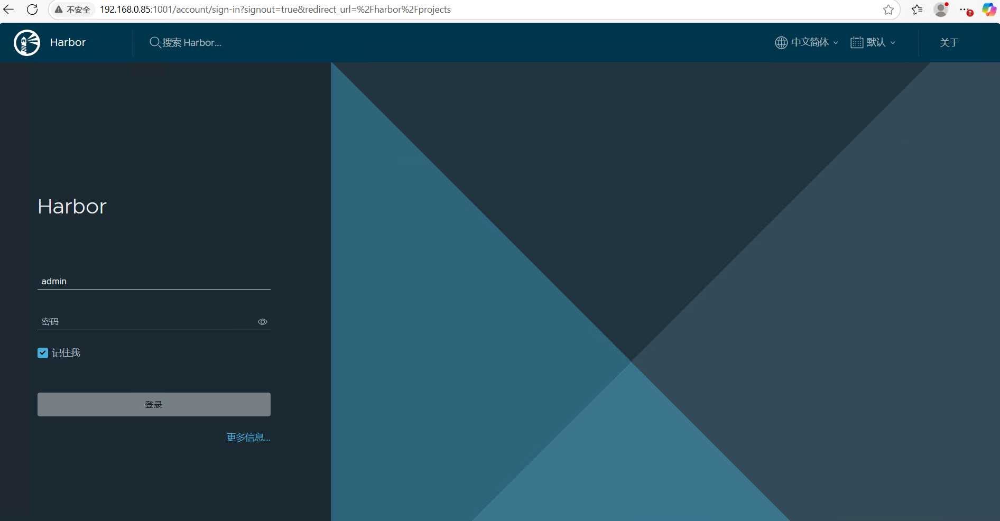
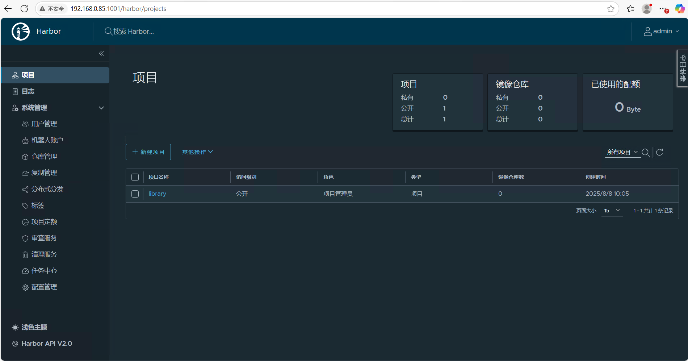

# Harbor 使用指南

# 商品链接

[Harbor-容器镜像仓库管理工具]()

# 商品说明

‌Harbor 是一个开源的企业级容器镜像仓库（Registry）管理工具，由 VMware 公司（现为 Broadcom 旗下）开发并捐赠给 CNCF（云原生计算基金会）。它提供了镜像存储、安全扫描、访问控制、多租户管理等高级功能，适用于 Kubernetes 和 Docker 等容器化环境。

# 商品购买

您可以在云商店搜索 **Harbor**。

其中，地域、规格、推荐配置使用默认，购买方式根据您的需求选择按需/按月/按年，短期使用推荐按需，长期使用推荐按月/按年，确认配置后点击“立即购买”。

# 商品资源配置

商品支持 **ECS 控制台配置**，下面对资源配置的方式进行介绍。

## ECS 控制台配置

### 准备工作

在使用ECS控制台配置前，需要您提前配置好 **安全组规则**。

> **安全组规则的配置如下：**
> - 入方向规则放通端口 `1001`，**源地址内必须包含您的客户端 ip**，否则无法访问
> - 入方向规则放通 CloudShell 连接实例使用的端口 `22`，以便在控制台登录调试
> - 出方向规则一键放通

### 创建ECS

前提工作准备好后，选择 ECS 控制台配置跳转到购买 ECS 页面，ECS 资源的配置如下图所示：

> **值得注意的是：**
> - VPC 您可以自行创建
> - 安全组选择 [**准备工作**](#准备工作) 中配置的安全组；
> - 弹性公网IP选择现在购买，推荐选择“按流量计费”，带宽大小可设置为5Mbit/s；
> - 高级配置需要在高级选项支持注入自定义数据，所以登录凭证不能选择“密码”，选择创建后设置；
> - 其余默认或按规则填写即可。

# 商品使用

## Harbor 使用

### 查看Harbor服务端状态

systemctl status harbor

### 查看Harbor相关容器状态

docker ps -a

### 访问Harbor管理后台

http://ip:1001
账号：admin 密码：Harbor12345

### 参考文档

[Harbor官网](https://goharbor.io/)